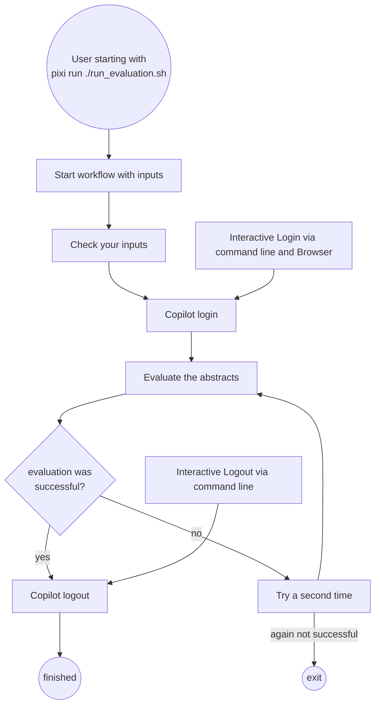

# climate_neutrality_review_LLM

Small Python framework to enrich publication Excel sheets with LLM-based extraction from abstract text.

## Evaluation workflow
The evaluation script `run_evaluation.sh` processes all steps from Login, evaluation, saving output and logout. 

### Quick start
Start the workflow by typing 
```bash
./run_evaluation.sh <input_file> <output_directory>
```
with
- input_file: the Excel-file to be used as input for the LLM
- output_directory: the name of the folder, the outputs should be saved to.

**Your input** is needed for Copilot login and logout: 
- Login:
  - after the Copilot-motto appeared, if login does not start automatically, type `/login`
  - You have to trust the "insecure" version of saving the credentials 
  - Use "Login with GitHub" - open the URL displayed (by copying it to your browser) - login to your GitHub Account and follow the instructions given - when you have finished the Authentification in the browser, the terminal-window will show the successful login procedere.
  -  press esc and type `exit` to exit the interactive mode of copilot.
- Logout: Check, if logout was successful, afterwards, type exit to exit the interactive mode of copilot. 




### Collect all evaluations
Start the collection of all evaluations with 
```bash
pixi run python integrate_answers_to_excel.py <input_file> <input_folder>
```
with 
- input_file: Excel-File, with the initial input-data. This must contain a column "DOI"
- input_folder: folder of all json-styled llm-output-files to be collected.

> [!NOTE]
> The code expects *exactly* the structure of llm-abstracts output. For other structured json-files (eg. full-text evaluation), this needs adaption.

## Python evaluation script
This script is used in the evaluation workflow and can easily be executed "by hand", if needed. 
### What it does
- Reads an Excel file where each row is one publication.
- Uses a configurable `abstract` column (or any user-selected column).
- Lets you define which output columns should be filled by the LLM.
- Builds a prompt row-by-row and asks for JSON output with exactly those fields.
- Writes one JSON file per row (named by DOI) into the output directory.

### Usage
```bash
pixi run python excel_llm_framework.py input.xlsx output_json_dir
```

Optional flags:
- `--abstract-column "Abstract"` (default: `Abstract`)
- `--instruction "..."` to customize extraction behavior

By default, the CLI sends each prompt to the installed Copilot CLI and writes one JSON file per row into the output directory. Each output file includes the `doi` value from the input row, so the input must contain a `DOI` column with non-empty values.

## Requirements
Use the pixi environment provided by typing 
```bash
pixi run
``` 
before the respective statements to run.

## Tests
```bash
python -m unittest discover -s tests -p "test_*.py"
```
